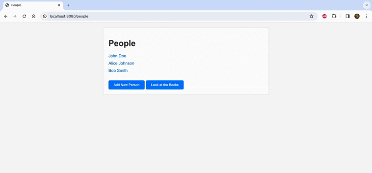

Library Manager
===============

Key Features
------------

1.  Adding new books with specified title, author, and publication year.
2.  Viewing a list of books with detailed information.
3.  Assigning a book to a specific user and releasing it from the association.
4.  Editing book information.
5.  Deleting books from the library.

Technologies
------------

1.  **Spring MVC:** Lightweight framework for developing Java web applications.
2.  **Thymeleaf:** Template engine for creating dynamic web pages using HTML markup.
3.  **PostgreSQL:** Relational database for storing information about books and users.
4.  **Hibernate ORM:** Object-relational mapping library for efficient database interaction and management of the data persistence layer.
5.  **Hibernate Validator:** Library for data validation and error handling.

Running the Project
-------------------

1.  Ensure that you have Java and Maven installed.
2.  Import the project into your development environment (e.g., IntelliJ IDEA, Eclipse).
3.  Install Apache Tomcat to run the application as a servlet. ([Download Apache Tomcat](http://tomcat.apache.org/))
4.  Run the application, specifying the database configurations in the `hibernate.properties` file.
5.  Access the Library Manager web interface at [http://localhost:8080](http://localhost:8080).

Note: 
Before running the application, ensure that the database schema is created. 
You can execute the SQL script in schema.sql to set up the required tables and schema.

Additional settings, such as database configuration and port, can be adjusted in the `application.properties` file.

Library Manager process in action
-------------------
   
