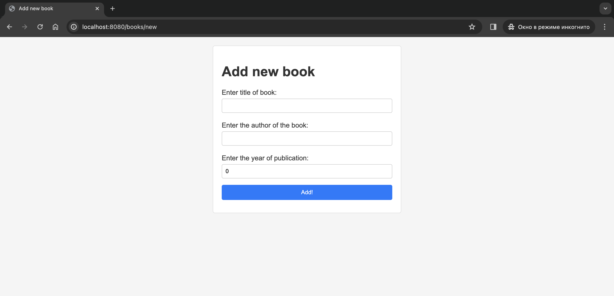
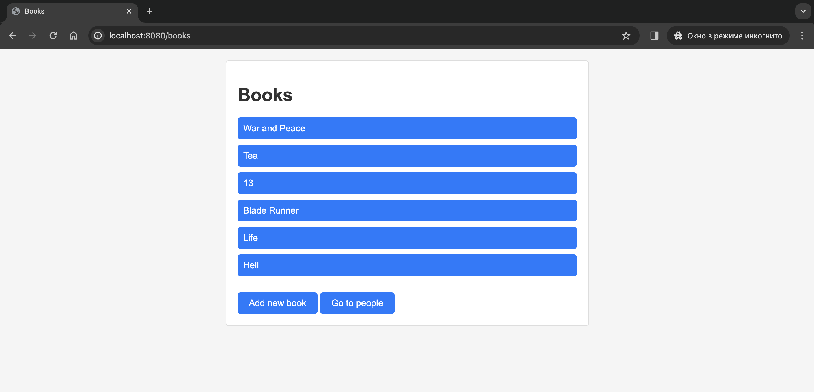
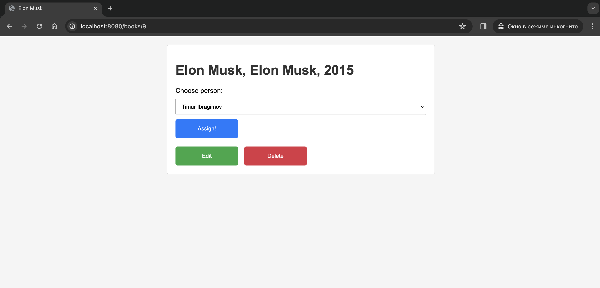
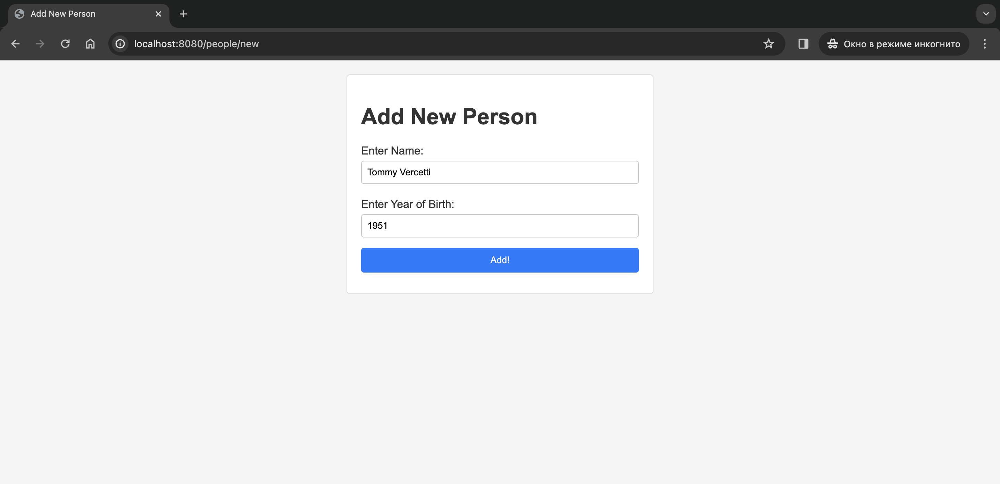
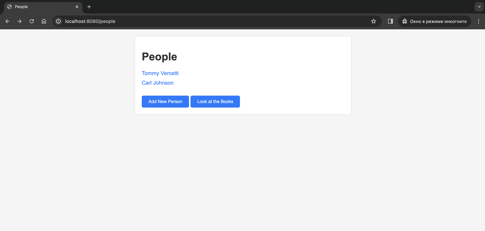

Library Manager
===============

Key Features
------------

1.  Adding new books with specified title, author, and publication year.
2.  Viewing a list of books with detailed information.
3.  Assigning a book to a specific user and releasing it from the association.
4.  Editing book information.
5.  Deleting books from the library.

Technologies
------------

1.  **Spring Boot:** Lightweight framework for developing Java web applications.
2.  **Thymeleaf:** Template engine for creating dynamic web pages using HTML markup.
3.  **PostgreSQL:** Relational database for storing information about books and users.
4.  **HikariCP:** Connection pool for efficient interaction with the database.
5.  **Hibernate Validator:** Library for data validation and error handling.

Running the Project
-------------------

1.  Ensure that you have Java and Maven installed.
2.  Import the project into your development environment (e.g., IntelliJ IDEA, Eclipse).
3.  Install Apache Tomcat to run the application as a servlet. ([Download Apache Tomcat](http://tomcat.apache.org/))
4.  Configure the application to use Tomcat by adding the `spring-boot-starter-tomcat` dependency in the `pom.xml` file.
5.  Run the application, specifying the database configurations in the `application.properties` file.
6.  Access the Library Manager web interface at [http://localhost:8080](http://localhost:8080).

Additional settings, such as database configuration and port, can be adjusted in the `application.properties` file.

Screenshots
-------------------

1. Adding new books with specified title, author, and publication year.
   

2. Viewing a list of books.
   

3. Assigning a book to a specific user and releasing it from the association.
   

4. Adding new person.
   

5. Viewing a list of people.
   