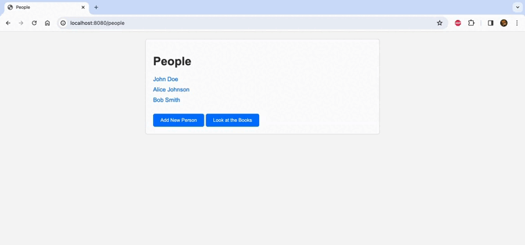

# Менеджер библиотеки

## Основные возможности

1.  Добавление новых книг с указанием названия, автора и года публикации.
2.  Просмотр списка книг с подробной информацией.
3.  Назначение книги конкретному пользователю и отвязка от него.
4.  Редактирование информации о книге.
5.  Удаление книг из библиотеки.

## Технологии

1.  Spring MVC
2.  Thymeleaf 
3.  PostgreSQL 
4.  Hibernate ORM
5.  Hibernate Validator

## Запуск проекта

1.  Убедитесь, что у вас установлены Java и Maven.
2.  Импортируйте проект в вашу среду разработки (например, IntelliJ IDEA, Eclipse).
3.  Установите Apache Tomcat для запуска приложения в качестве сервлета. ([Скачать Apache Tomcat](http://tomcat.apache.org/))
4.  Запустите приложение, указав конфигурации базы данных в файле `hibernate.properties`.
5.  Откройте веб-интерфейс менеджера библиотеки по адресу [http://localhost:8080](http://localhost:8080).

**Примечание:** Перед запуском приложения убедитесь, что схема базы данных создана. Вы можете выполнить SQL-скрипт в файле `schema.sql` для настройки необходимых таблиц и схемы.

## Процесс работы с Менеджером библиотеки в действии

